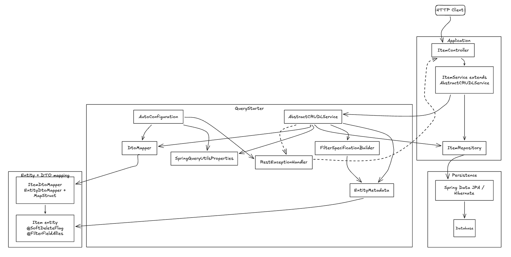

# Spring Query Utils

[](https://openjdk.org/)
[](https://spring.io/projects/spring-boot)
[]()

Spring Boot starter для типового **CRUD + List**: базовый сервисный слой, строковый DSL фильтров поверх JPA, soft
delete, пагинация и MapStruct DTO.

---

## Содержание

- [Требования](#требования)
- [Установка](#установка)
- [Quickstart](#quickstart)
- [Архитектура](#архитектура)
- [Entity и аннотации](#entity-и-аннотации)
- [Фильтры](#фильтры)
- [Пагинация и сортировка](#пагинация-и-сортировка)
- [Soft delete](#soft-delete)
- [DTO](#dto)
- [Конфигурация](#конфигурация)
- [Ошибки API](#ошибки-api)
- [Ограничения](#ограничения)
- [Тесты](#тесты)

---

## Требования

|                 |                                                              |
|-----------------|--------------------------------------------------------------|
| Java            | 21+                                                          |
| Spring Boot     | 4.x                                                          |
| Spring Data JPA | да                                                           |
| MapStruct       | да                                                           |
| Web             | `spring-boot-starter-web` у вас - для `RestExceptionHandler` |

---

## Установка

```xml

<dependency>
    <groupId>io.github.twlnky</groupId>
    <artifactId>spring-query-utils-spring-boot-starter</artifactId>
    <version>0.0.1-SNAPSHOT</version>
</dependency>
```

MapStruct в приложении:

```xml

<dependency>
    <groupId>org.mapstruct</groupId>
    <artifactId>mapstruct</artifactId>
    <version>1.6.3</version>
</dependency>
<dependency>
<groupId>org.mapstruct</groupId>
<artifactId>mapstruct-processor</artifactId>
<version>1.6.3</version>
<scope>provided</scope>
</dependency>
```

---

## Quickstart

### 1. Entity

```java

@Entity
public class Item {

    @Id
    @GeneratedValue(strategy = GenerationType.IDENTITY)
    private Long id;

    @FilterFieldAllies(alias = "itemName", operator = SqlOperator.LIKE)
    private String name;

    @FilterFieldAllies(operator = SqlOperator.GREATER)
    private Integer score;

    @SoftDeleteFlag
    private boolean deleted;

}
```

### 2. Repository

```java
public interface ItemRepository
        extends JpaRepository<Item, Long>, JpaSpecificationExecutor<Item> {
}
```

### 3. MapStruct mapper

```java

@Mapper(componentModel = "spring")
public interface ItemDtoMapper extends EntityDtoMapper<Item, ItemDto> {

    ItemDto toDto(Item model);

    Item toModel(ItemDto dto);

    @Override
    default Class<Item> modelClass() {
        return Item.class;
    }

    @Override
    default Class<ItemDto> dtoClass() {
        return ItemDto.class;
    }
}
```

### 4. Service

```java

@Service
public class ItemService extends AbstractCRUDLService<Item, Long, ItemRepository> {

    public ItemService(ItemRepository repository, DtoMapper dtoMapper, EntityManager em) {
        super(repository, dtoMapper, em, Item.class);
    }
}
```

### 5. Controller

```java

@GetMapping("/items")
public PageableResult<List<ItemDto>> list(
        @RequestParam(required = false) List<String> filter,
        @RequestParam(defaultValue = "0") int page,
        @RequestParam(defaultValue = "20") int size,
        @RequestParam(required = false) String sortField,
        @RequestParam(defaultValue = "DESC") String direction
) {
    Filter f = new Filter();
    if (filter != null) {
        f.getFilter().addAll(filter);
    }
    Sort sort = sortField != null
            ? new Sort(sortField, Sort.SortDirection.valueOf(direction))
            : null;
    return itemService.list(f, new Pagination(page, size), sort, ItemDto.class);
}
```

### HTTP-запрос

```http
GET /items?filter=itemName:LIKE:test&filter=score:GREATER:10&page=0&size=20&sortField=score&direction=DESC
```

---

## Архитектура



---

## Entity и аннотации

### `@FilterFieldAllies`

Помечает поле entity как доступное для фильтрации и сортировки.

| Атрибут    | Назначение                                                   |
|------------|--------------------------------------------------------------|
| `alias`    | ключ                                                         |
| `value`    | JPA-путь, если поле вложенное                                |
| `operator` | оператор по умолчанию, если в строке фильтра оператор пустой |

### `@SoftDeleteFlag`

Поле `boolean`: `delete(id)` выставляет `true`, `getById` / `list` / `update` не возвращают удалённые записи.

---

## Фильтры

Формат одного условия:

```text
ключ:ОПЕРАТОР:значение
```

- разделитель — первые два `:`, остаток строки = value (можно использовать `:` внутри value);
- несколько условий в одном `Filter` → **AND**.

### Операторы

| ОПЕРАТОР     | Пример                      |
|--------------|-----------------------------|
| `EQUALS`     | `status:EQUALS:ACTIVE`      |
| `NOT_EQUALS` | `status:NOT_EQUALS:DELETED` |
| `LIKE`       | `itemName:LIKE:test`        |
| `GREATER`    | `score:GREATER:10`          |
| `LESS`       | `score:LESS:100`            |
| `IN`         | `status:IN:ACTIVE,PENDING`  |
| `IS_NULL`    | `comment:IS_NULL:`          |

### Типы значений

### Программное использование

```java
Filter filter = new Filter();
filter.

getFilter().

add("itemName:LIKE:alpha");
filter.

getFilter().

add("score:GREATER:10");

itemService.

list(filter, new Pagination(0, 20), null);
```

---

## Пагинация и сортировка

```java
Pagination pagination = new Pagination(0, 20);
Sort sort = new Sort("score", Sort.SortDirection.DESC);
```

| Правило      | Значение                                               |
|--------------|--------------------------------------------------------|
| `page`       | больше или равно 0                                     |
| `size`       | 1 или `spring.query-utils.max-page-size` (default 100) |
| `sort.field` | только `@Id` и поля с `@FilterFieldAllies`             |

---

## Soft delete

| Метод                         | Поведение                              |
|-------------------------------|----------------------------------------|
| `delete(id)`                  | `deleted = true`, строка в БД остаётся |
| `getById` / `list` / `update` | не видят `deleted = true`              |

---

## DTO

Starter не генерирует мапперы за вас — только собирает их в `DtoMapper`.

1. DTO-класс в приложении.
2. Интерфейс с `@Mapper(componentModel = "spring")`, extends `EntityDtoMapper<M, D>` — см. [Quickstart](#quickstart),
   шаг 3.
3. В сервисе: `list(..., ItemDto.class)`, `getById(id, ItemDto.class)` или напрямую
   `dtoMapper.toDto(entity, ItemDto.class)`.

---

## Конфигурация

```properties
# включить / выключить auto-config (default true)
spring.query-utils.enabled=true
# максимальное количество записей после запроса (default 100)
spring.query-utils.max-page-size=100
# RestExceptionHandler (default true) нужен spring-boot-starter-web
spring.query-utils.exception-handler-enabled=true
```

---

## Ошибки API

При `spring-boot-starter-web` и включённом handler:

| Исключение                  | HTTP | Тело            |
|-----------------------------|------|-----------------|
| `ResourceNotFoundException` | 404  | `ProblemDetail` |
| `ValidationException`       | 400  | `ProblemDetail` |

---

## Ограничения

- только AND между фильтрами
- soft delete - только `boolean`
- один `EntityDtoMapper` на пару entity/DTO
- `DriverUtils` / `DatabaseType` не используются в CRUD-потоке

## Тесты

```bash
mvn test
```

---


